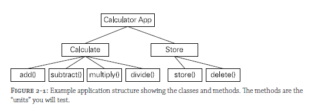
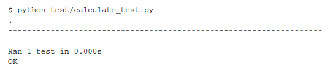
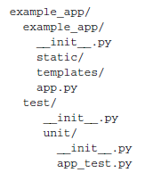
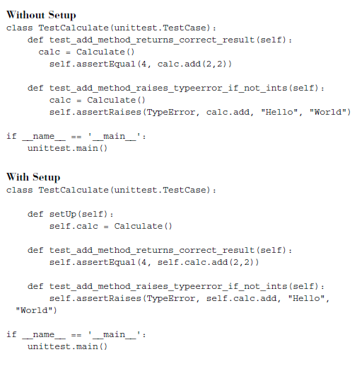
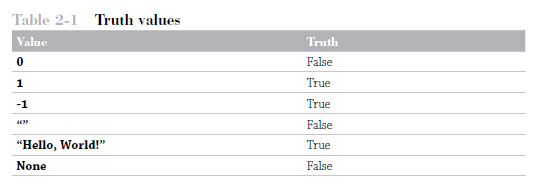
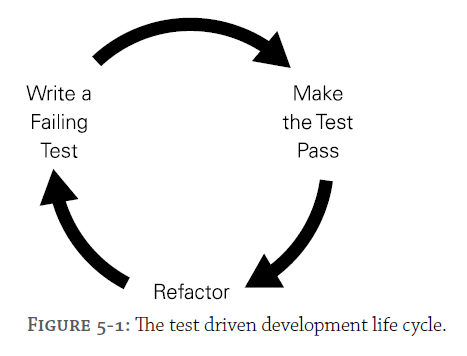
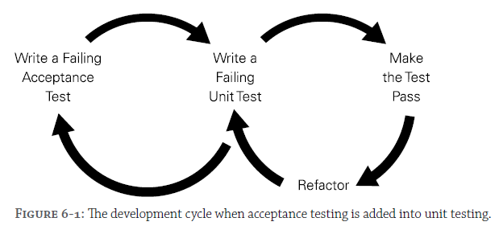

# Testing Python Applying Unit Testing, TDD, BDD and Acceptance Testing by David Sale

## 1. A History of Testing
## 2. Writing Unit Tests
## 3. Utilizing Unit Test Tools
## 4. Writing Testable Documentation
## 5. Driving Your Development with Tests
## 6. Writing Acceptance Tests
## 7. Utilizing Acceptance Test Tools
## 8. Maximizing Your Code's Performance
## 9. Looking After YOur Lint
## 10. Automating Your Processes
## 11. Deploying Your Application
## 12. The Future of Testing Python

---
---

# 1. A History of Testing

## Introduction

THE IDEA OF testing is one that has evolved over many years in the development community. Developers used to have much less focus on testing up front and just wrote code and dealt with any problems that arose by quickly writing fixes after a testing period at the end of a project. That isn’t to say that there weren’t developers out there who were writing code that was trouble free when out in the wild, but on the whole, writing code without tests in general is going to lead to problems down the line. There were also cases where testing was a priority, such as code that could cause destruction or the possibility of a person dying. In such circumstances there would be rigorous testing, but this was very much the exception rather than the rule.

The first real change in ideology came with improvements in technology and the resulting development pressures that came with it. When computers were slower, code modification cycles took much longer. Even a simple program could take tens of minutes to build, and large projects could take hours. This resulted in a batch development process where people spent a great deal of time pouring over code, figuring out issues, and then making sets of changes. The amount of time spent verifying changes to the code was comparatively small compared with the cycle time.

As computers became faster, compilation times shrank and development cycle times correspondingly shrank. It became feasible to make small changes to code, quickly build the product, and then verify the results of those few changes. This meant that code was written and tests covered that code to ensure it behaved as expected. Also, as computer systems became more powerful, the complexity of software increased. Even a simple program these days often has both a client and server component running on different systems (such as a browser and web server). Operating systems offer a bewildering variety of services to a program. Choreographing these interactions requires managing complexity in a systematic way. Features of Python such as loose typing impose additional verification demands on developers, as errors in coding cannot be caught at a compilation stage. Similarly, because Python has no demands on the type of objects it is manipulating, you can end up with strange behavior if you have not handled all cases correctly.

Testing forces developers to think about the code that they are writing and consider all sorts of different scenarios and the outcomes rather than focusing on the happy path scenario that takes into account only how the code should be used. When combined with a test driven development approach (TDD; see Chapter 5), this ideology ensured that testing was baked in to the development process and not a tedious afterthought. One of the worst traps a developer can fall into is writing a bunch of code and then going back and testing it all at the end. Not only is this approach more time consuming and often rushed, but it also means revisiting code that isn’t fresh in the mind like it was at the time of writing. When you revisit the method to write a test, the context and thought process at the time of writing is often lost to you.

Similarly, the change from the waterfall development processes to agile has brought a huge focus on testing while developing rather than treating testing as an afterthought, as I describe previously. Agile development advocates that teams include dedicated quality assurance (QA) personnel, whose sole focus is to write tests and maintain a solid test suite around the application. This allows someone who hasn’t written the code to look at it from a fresh angle and perhaps spot weaknesses or bugs in the code before those glitches reach the customer.

Following on from TDD, agile development also spawned the concept of behavior driven development (BDD; see Chapter 6). This method takes unit testing one step further and looks to test the application’s behavior in terms of functionality being delivered. BDD is also known as an acceptance test and generally comes in the form of a human readable feature file, which describes the functionality and then maps to step files, which execute the test code underneath. The huge benefit of this approach is that non-technical team members, such as a scrum master (person responsible for removing impediments that arise in a team and assists in organizational matters) or product owner (person wanting the deliverable and setting the requirements for the project), can write feature files, and then the developer or QA can implement the code underneath. With this setup in place, you basically have testable documentation for your system that anyone on the team can understand. This approach also allows you to create a failing acceptance test that you develop your code to pass, ensuring that you deliver the feature you have set out to create. Unit testing alone does not produce such reliable results. It is the combination of the two testing practices that ensures you can deliver quality software and be confident when it goes live.

Clearly, the mindset of developers has changed over the years from not just writing code but to ensuring that their code is tested from all angles. From unit testing to acceptance testing, Python developers have implemented libraries and tools to help Python developers follow these changes to the development process. This book covers their implementation and usage so that you too can get up to speed on the latest testing tools and techniques to ensure you are not left stuck in the past of testing history.

## You Do Test, Don’t You?

A huge shift has occurred in recent years of software development toward testing and ensuring that your application delivers absolute quality. With the advent of social networks and the ever-increasing pressure of media attention, defects in your code could be costly to both you and your reputation or that of any company you may represent. Whether it be security flaws exposing sensitive customer data, defects that allow hackers access to deface your website, or simply a payments page failing to execute orders, errors can cost your business huge sums of money.

Don’t think of problems on only the large-scale, either. Without a proper testing suite in place, how do you know you have delivered the functionality you set out to deliver at the beginning of writing code? Take a simple data submission form. You have coded the fields to accept a name, address, and e-mail, without any testing. You quickly enter the data as expected and your submit works fine. But what if your customers enter something you didn’t expect in the fields—for instance, a number in the name field? Does your code handle this? What if you make changes to the code? Are you sure that the program still functions as it should?

You can see some of the problems developers face when writing code of this nature and how testing can give you a repeatable process that ensures you are delivering working software every time. Luckily for you, this shift in mindset to place such importance in testing has spawned numerous, quality testing tools and frameworks to make the process as simple as possible.

You can certainly make great code without tests. In fact, it is highly likely that many software houses put out software without rigorous testing. The key advantage of writing tests, especially as part of the development process, is that testing gives you confidence in your code before it goes live. As a developer, you are often on call to support your applications in the middle of the night. Do you really want that phone call at 3 a.m. because you didn’t write tests to cover that edge case? Testing won’t stop this from ever happening again, but it will make it a very rare occurrence. You will have good knowledge of the different routes through your system, making it easier to debug the situations where the worst may happen.

# 2. Writing Unit Tests

## What Is Unit Testing?

In unit testing, you look to cover the application’s functionality at its most basic level. Test each individual unit of code, typically a method, in isolation to see if given certain conditions it responds in the expected way (see Figure 2-1). Breaking testing down to this level gives you confidence that each part of the application will behave as expected and enables you to cover edge cases where the unexpected happens and deal with them accordingly.



In the preceding example, the methods highlighted are the individual units of this application that you need to test. If you know that each of the calculate class’s methods work as expected, you can be confident that the calculate feature of your application has been delivered to your expectations.

For instance, you may wish to test whether the result of calling the method with two numbers actually adds them together to produce the correct sum. Breaking your code down into these units makes the testing process easier. When dealing with a small unit of an application, you have a clear understanding of its responsibilities and the things that can go wrong with the specific piece of code, thus enabling you to cover the unit with the appropriate tests.

Furthermore, when testing in this manner it usually becomes obvious if you have broken down the code into a good-sized unit. If you have to write many different tests to cover all the different possibilities that the method can go through, your method may be too large and you should consider refactoring it into two or more methods with fine-grained responsibilities. Conversely, there may be cases where your method is too simple and could be combined with some other functionality to create a more useful method. As a programmer with experience, you should start to get a feel for a good-sized method. Ten lines is often a good rule of thumb to follow. There are, of course, plenty of cases where you need more or less than this arbitrary number of lines, and as a programmer your common sense should guide you to provide the most readable code.

The tests that you write are a story that explains your code. What would you want to read or see when first reading through the code and trying to understand what it does? Clear, concise naming conventions of variables, class names, filenames, and tests can all help to make your code clear and easy to maintain for other people.

Testing and, in particular, test driven development (TDD; see Chapter 5), can really help to achieve these goals. TDD forces you to think about your code, and in this moment of careful consideration you can take into account the needs of the application, the design of the code, and how other programmers will interpret your intentions. Use testing to your advantage to make your code cleaner and more efficient. With a good test suite in place, refactoring is easy because you know when you change your code you haven’t broken any previous behavior. The tests take the guesswork out of your development process and you can deliver great applications, knowing you have delivered something robust and reliable.

## What Should You Test?

A question that many developers ask especially when first starting out is, what should I test? This is an interesting question and also a fair one, as the applications that are being built now are often vast with many complexities. However, unit testing makes the task easier as the whole idea is to focus on the smallest units of code rather than thinking about how to test the large application you are putting together as a whole. Before you write any code you give thought to the kind of tests you will be writing to check the methods will work as expected. As you write more and more unit tests you will gain experience in what works well and what perhaps causes you issues later down the line. For example, a frequent mistake of inexperienced developers is writing very brittle test suites. This means that as code evolves the tests break for reasons other than the functionality changing. The tests are often checking elements of the code or data to too fine a granularity, meaning that as data changes (and not your functionality, which is what you are really testing), the tests fail and you need to go and fix it. Making your tests as flexible as possible while still testing your functionality is the best way to defend against this brittleness.

Another reason to test comes from the process of finding bugs whether in a production environment, the test environment, or while testing your application locally. Whenever you find a bug that affects your application that requires a code change to fix, you should write a test to cover that scenario. By doing this, you ensure that you have covered the defect that caused the problem and with test in place the bug should not reoccur in the future. By adding this layer of defense every time you find a bug (hopefully, not very often) you ensure that your code is more robust in the future as more functionality is added.

## Writing Your First Unit Test

By now, you are probably eager to start writing your first unit test. Perhaps you have written tests before but are looking for a refresher in how to write good, concise unit tests. Whatever your Python or testing background, let’s start at the beginning with some simple tests for a straightforward application. The examples first show you how to structure your test into a class with the correct naming conventions. Further on in the chapter, you are simply shown snippets of test methods, which you are expected to use with a proper test class.

One of the classic examples for demonstrating unit testing is a small calculator program. Python actually includes a lot of basic math functionality in the standard library. But what if you wrapped that into a simple-to-use command line application that could perform some simple calculations? This first scenario demonstrates how to implement the calculate class of the application example from earlier. Start with the add method, which looks something like this.

```Python3
class Calculate():
    def add(self, x: int, y: int) -> int:
        if type(x) == int and type(y) == int:
            return x + y
        else:
            raise TypeError("Invalid type: {0} and {1}".format(type(x), type(y)))


if __name__ == '__main__':
    calc = Calculate()
    result = calc.add("Hello", "World")
    print(result)
```

Clearly, this is a very simple class that is just making use of Python’s built-in math function for adding and making it into a method you can call in your code. Save this code to a file named calculate.py, then execute this and see the result, like so.

```
$ python calculate.py
4
```

## Checking Values with the assertEquals Method

You have some working code, so why not write the tests to prove it and look into what could go wrong if the code is used in ways you didn’t foresee? Try writing a test that checks to see that if you pass in the two numbers as 2, then you get the result as 4. Using the standard Python library, you can import the unittest package. This provides useful methods to make different kinds of assertions (for instance, checking whether something meets some condition) on your method. One of those assertions you can use is the assertEqual method. This method allows you to pass in two values and check whether they are equal.

Create a test file called calculate_test.py, following the standard naming conventions of using the class name under test and appending with _test.

```Python3
import unittest
from calculate import Calculate


class TestCalculate(unittest.TestCase):
    def setUp(self) -> None:
        self.calc = Calculate()

    def test_add_method_raises_typeerror_if_not_ints(self):
        self.assertRaises(TypeError, self.calc.add, "Hello", "World")

    def test_add_method_returns_correct_result(self) -> None:
        self.assertEqual(4, self.calc.add(2, 2))


if __name__ == '__main__':
    unittest.main()
```

A line-by-line examination shows that this example first imports the functionality you need from Python’s unittest module. You are also importing your own class, Calculate, so that you can test its methods. You do this in the setUp method, which is executed before each test, so that you need define your instance only once and have it created before each test. Then you can write your test and again the standard is to append your test name with append_test and explain what the test is doing briefly in the rest of the name. Here you are checking if the add method returns the correct result. To do this, you make use of the assertEqual method provided by the imported unittest module. This checks if the first argument is equal to the second. In this example, you are checking whether 4 is equal to the result of calling your add method on 2 and 2. In this case, the test passes as your code works and displays the following result in the terminal.



## Following the PEP-8 Standard

As I have been introducing you to unit testing in Python, it should be clear that various patterns and standards are followed within the Python community. Some of them are enforced by tools you may wish to use, such as prepending a test name with test_ to allow runners such as Nose to find tests to execute. Others are merely standards set by Python developers to keep readability and reuse of code high as it is shared between developers. It helps to give Python code a consistent look and feel that experienced developers are familiar with, and if teams adhere to the accepted standards then when developers move to a new Python project, many aspects of the code should feel familiar.

All Python developers code should conform to the standards outlined within the PEP-8 document (available on the Python website at http://legacy.python.org/dev/peps/ pep-0008/). Guido van Rossum, creator of the Python language, along with Barry Warsaw and Nick Coghlan, writes the style guide. The document is one of the most famous PEPs (Python Enhancement Proposals) and also one of the earliest. PEPs are put forward as suggestions for changes to the language or how to use it. PEP-8 focuses on the styling of code and puts forward some of the fundamental principles when writing Python code and tests, such as:

* Indents: Four spaces for each indentation
* Maximum line length: 80 characters.
* Blank lines: Two between import, class, and function definitions. One between method definitions inside a class.
* Import statements: Should be one per line.
* Class names: Should have capitals for the first letter of each word.
* Method names: Should use all lowercase and underscores to separate words.

You should endeavor to maintain these standards and use them throughout the code you write. You will also see them followed throughout this book. You can find the whole PEP-8 document and others at www.python.org/dev/peps/. Fortunately, tools have been created to keep your code in check with the standard, such as PyLint.

## Unit Test Structure

When structuring your project, you can follow some clear standards to make your application’s code more accessible to other Python developers. These simple rules are easy to apply and result in a uniform structure to make it easy to find the test and code files you need.

* Unit tests should be placed under a test/unit directory at the top level of your project folder.
* All folders within the application’s code should be mirrored by test folders under test/unit, which will have the unit tests for each file in them. For example, app/ data should have a mirrored folder of test/unit/app/data.
* All unit test files should mirror the name of the file they are testing, with _testas the suffix. For example, app/data/data_interface.py should have a test file of test/unit/app/data/data_interface_test.py.

To illustrate these rules even more, take a look at one example of how you might structure a Flask project. Flask is the Python web framework package, which you can read more about at http://flask.pocoo.org.



The ```__init__.py``` files indicate that the folder is a Python package so that you can import them into other Python files. For example, in app_test.py, you need to import methods from app.py so that you can test it.

You are, of course, free to structure your project however you like. This is simply a recommended structure that many developers follow.

## Making Your Life Easier with setUp

Unit testing often includes a lot of repeated code. You generally need to create instances of classes to be able to use the methods on them in multiple tests. Following good software development practices such as D.R.Y (Don’t Repeat Yourself) and Clean Code: A Handbook of Agile Software Craftsmanship by Robert Cecil Martin (Prentice–Hall, 978-0132350884), you should avoid duplicating code and keep tests as succinct as possible.

Following these principles means that changes to your tests are kept to a minimum; a mistake in duplicated code will need to be changed everywhere it was used. It also ensures your tests are easier to debug. If the test is literally executing the code it is designed to test as opposed to multiple lines of setup, then the developer will be able to clearly see the point of failure and aid in getting the problem fixed.

This is where the setUp method comes in. Although oddly named by Python conventions (it perhaps should be set_up or setup), this aspect of unit testing is powerful and minimizes the code you need to write down. Next I use the calculator example with and without the setUp method to illustrate.



Even in this simple test case scenario, the addition of the setUp method means you only need to create the instance of Calculate once for it to be available to all test cases. Imagine how advantageous it is to be able to create this just once if you needed to test many more scenarios than just these two. Say, for example, you hadn’t used the setUp but created the Calculate class in each test case. Say your class had grown and you now had 15 test cases where this is now created. What if the initializer for Calculate changed and you now needed to pass in some new variables to the class? Instead of just one change in the setUp, you now need to change 15 lines of code.

It should be noted that even through the use of setUp, there is nothing to stop you having some test case which doesn’t make use of the objects created in the setup. Perhaps you need to test a slightly different scenario, which requires a different setUp. In this case you can just use locally created variables rather than the class level objects the setUp method will provide. This is more obvious in cases where you need to mock external libraries or calls. For example, a call to a database might need to be mocked the same way for 90% of your tests, so that would be done in the setup. You may then need to mock it differently to test an error case, which you would do in that test only, ignoring the variables created in the setup.

## Useful Methods in Unit Testing

This section provides a quick guide to all the different methods available in the unit test package. For each one, a description of its usage and an example are provided. All methods that take an optional argument, msg=None, can be provided a custom message that is displayed on failure.

### ```assertEqual(x, y, msg=None)```

This method checks to see whether argument x equals argument y. Under the covers, this method is performing the check using the == definition for the objects.

```Python3
def test_assert_equal(self):
    self.assertEqual(1, 1)
```

### ```assertAlmostEqual(x, y, places=None, msg=None, delta=None)```

On first glance, this method may seem a little strange but in context becomes useful. The method is basically useful around testing calculations when you want a result to be within a certain amount of places to the expected, or within a certain delta.

```Python3
def test_assert_almost_equal_delta_0_5(self):
    self.assertAlmostEqual(1, 1.2, delta=0.5)
    
def test_assert_almost_equal_places(self):
    self.assertAlmostEqual(1, 1.00001, places=4)
```

### ```assertRaises(exception, method, arguments, msg=None)```

Given a method and set of arguments to that method, does it raise the exception? Arguments must match the signature of the method or syntax error is raised. Arguments are passed as comma-separated lists, not as part of the method call, as shown in the following example:

```Python3
def test_assert_raises(self):
    self.assertRaises(ValueError, int, "a")
    
def test_assert_raises_alternative(self):
    with self.assertRaises(AttributeError):
        [].get
```

### ```assertDictContainsSubset(expected, actual, msg=None)```

Use this method to check whether actual contains expected. It’s useful for checking that part of a dictionary is present in the result, when you are expecting other things to be there also. For example, a large dictionary may be returned and you need to test that only a couple of entries are present.

```Python3
def test_assert_dict_contains_subset(self):
    expected = {'a': 'b'}
    actual = {'a': 'b', 'c': 'd', 'e': 'f'}
    self.assertDictContainsSubset(expected, actual)
```

### ```assertDictEqual(d1, d2, msg=None)```

This method asserts that two dictionaries contain exactly the same key value pairs. For this test to pass, the two dictionaries must be exactly the same, but not necessarily in the same order.

```Python3
def test_assert_dict_equal(self):
    expected = {'a': 'b', 'c': 'd'}
    actual = {'c': 'd', 'a': 'b'}
    self.assertDictEqual(expected, actual)
```

### ```assertTrue(expr, msg=None)```

Use this method to check the truth value of an expression or result. This method can be useful and has a few interesting caveats. This is because Python’s implicit truth behavior, such as numeric values like 0 and 1 have truth-value of False and True, respectively. Table 2-1 lists some implied truths along with test examples, but more information can be found in the Python documentation.



```Python3
def test_assert_true(self):
    self.assertTrue(1)
    self.assertTrue("Hello, World")
```

### ```assertFalse(expr, msg=None)```

This method is the inverse of assertTrue and is used for checking whether the expression or result under the test is False.

```Python3
def test_assert_false(self):
    self.assertFalse(0)
    self.assertFalse("")
```

### ```assertGreater(a, b, msg=None)```

This method allows you to check whether one value is greater than the other. It is essentially a helper method that wraps up the use of assertTrue on the expression a > b. It displays a helpful message by default when the value is not greater.

```Python3
def test_assert_greater(self):
    self.assertGreater(2, 1)
```

### ```assertGreaterEqual(a, b, msg=None)```

You use this method to check whether one value is greater than or equal to another value. Essentially, this wrapper is asserting True on a >= b. The assertion also gives a nicer message if the expectation is not met.

```Python3
def test_assert_greater_equal(self):
    self.assertGreaterEqual(2, 2)
```

### ```assertIn(member, container, msg=None)```

With this method, you can check whether a value is in a container (hashable) such as a list or tuple. This method is useful when you don’t care what the other values are, you just wish to check that a certain value(s) is in the container.

```Python3
def test_assert_in(self):
    self.assertIn(1, [1,2,3,4,5])
```

### ```assertIs(expr1, expr2)```

Use this method to check that expr1 and expr2 are identical. That is to say they are the same object. For example, the python code [] is [] would return False, as the creation of each list is a separate object.

```Python3
def test_assert_is(self):
    self.assertIs("a", "a")
```

### ```assertIsInstance(obj, class, msg=None)```

This method asserts that an object is an instance of a specified class. This is useful for checking that the return type of your method is as expected (for instance, if you wish to check that a value is a type of int):

```Python3
def test_assert_is_instance(self):
    self.assertIsInstance(1, int)
```

### ```assertNotIsInstance(obj, class, msg=None)```

This reverse of assertIsInstance provides an easy way to assert that the object is not a type of the class.

```Python3
def test_assert_is_not_instance(self):
    self.assertNotIsInstance(1, str)
```

### ```assertIsNone(obj, msg=None)```

Use this to easily check if a value is None. This method provides a useful standard message if not None.

```Python3
def test_assert_is_none(self):
    self.assertIsNone(None)
```

### ```assertIsNot(expr1, expr2, msg=None)```

Using this method, you can check that expr1 is not the same as expr2. This is to say that expr1 is not the same object as expr2.

```Python3
def test_assert_is_not(self):
    self.assertIsNot([], [])
```

### ```assertIsNotNone(obj, msg=None)```

This method checks that the value provided is not None. This is useful for checking that your method returns an actual value, rather than nothing.

```Python3
def test_assert_is_not_none(self):
    self.assertIsNotNone(1)
```

### ```assertLess(a, b, msg=None)```

This method checks that the value a is less than the value b. This is a wrapper method for assertTrue on a < b.

```Python3
def test_assert_less(self):
    self.assertLess(1, 2)
```

### ```assertLessEqual(a, b, msg=None)```

This method checks that the value a is less than or equal to the value b. This is a wrapper method for assertTrue on a <= b.

```Python3
def test_assert_less_equal(self):
    self.assertLessEqual(2, 2)
```

### ```assertItemsEqual(a, b, msg=None)```

This assertion is perfect for testing whether two lists are equal. Lists are unordered; therefore, assertEqual on a list can produce intermittent failing tests as the order of the lists may change when running the tests. This can produce a failing test when in fact the two lists have the same contents and are equal.

```Python3
def test_assert_items_equal(self):
    self.assertItemsEqual([1,2,3], [3,1,2])
```

### ```assertRaises(excClass, callableObj, *args, **kwargs, msg=None)```

This assertion is used to check that under certain conditions exceptions are raised. You pass in the exception you expect, the callable that will raise the exception and any arguments to that callable. In the earlier example, this pops the first item from an empty list and results in an IndexError.

```Python3
def test_assert_raises(self):
    self.assertRaises(IndexError, [].pop, 0)
```

# 3. Utilizing Unit Test Tools

## Mocking a Class and Method Response

Creating a mock is fairly simple. You simply need to import the Mock class and then create an instance of it. You can then attach methods to the mock that you want to return some value. Create a test file called mock_example_test.py and use the following code.

```Python3
import unittest
from mock import Mock


class TestMocking(unittest.TestCase):
    def test_mock_method_returns(self):
        my_mock = Mock()
        my_mock.my_method.return_value = "hello"
        self.assertEqual("hello", my_mock.my_method())


if __name__ == '__main__':
    unittest.main()
```

In this example, you can create an instance of the mock named my_mock, add the my_method to it, and state that when it is called, it should return the string "hello".

You may now wonder how this is useful when testing your application. Suppose you have a program that looks up accounts from a database. If that account class is initialized using a data_interface class to call a database for the account information, then instead of providing a real data_interface you can instead mock the data_interface and provide the methods and return values you need for your test. Because the data_interface class is a whole other class with set responsibilities, the testing for this class should be assumed as handled elsewhere. To that end, the mock data_interface will just be set up to have a dummy method on it and return whatever you like when it is called. This allows you to set up the scenarios and use cases of the code as required, such as returning a value successfully for an account or returning some error case.

To illustrate this example with some code, your simple Account class may look something like this:

```Python3
class Account:
    def __init__(self, data_interface):
        self.di = data_interface

    def get_account(self, id_num):
        return self.di.get(id_num)
```

The class has just one method that returns the data obtained from the database related to the provided ID number. Now write a test to check that the data is returned correctly for ID 1 given the data that you set up in the mock data_interface. Create a test file called account_test.py and try the following code:

```Python3
import unittest
from mock import Mock
from account import Account


class TestAccount(unittest.TestCase):
    def test_account_returns_data_for_id_1(self):
        account_data = {
            "id": 1,
            "name": "test"
        }

        mock_data_interface = Mock()
        mock_data_interface.get.return_value = account_data

        account = Account(mock_data_interface)

        self.assertDictEqual(account_data, account.get_account(1))


if __name__ == '__main__':
    unittest.main()
```

By passing in the mock_data_interface in this way, you can create the scenario you need to exercise only the Account class without testing any of the functionality provided by the data_interface class


# 4. Writing Testable Documentation

\-

# 5. Driving Your Development with Tests

## Agile Development

Agile is a process that has become increasing popular in recent years, both in personal or smaller projects and within large business such as BSkyB, Facebook, Spotify, and Netflix, to name a few. But why are the big companies moving to such a process and what benefits does it bring? The main driver behind agile development is that it is an iterative process (usually in cycles of two to four weeks), with a working deliverable at the end of each iteration. A big plus point to this process is that it removes the pressure of deadlines to some degree and teams can work to deliver a minimum viable product within a certain time frame. Basically this means you deliver the smallest product that you could release to customers that would add business value. Once you have developed this product, you can then continue to iterate and add more features. It’s easy to see how this can be viewed as a more stable process for delivering software than in the waterfall method, which effectively has one “big bang” release after many weeks/months/years of development.

The agile manifesto was drafted in February 2001. It aimed to offer guidance and explain the fundamentals of the agile development process. The manifesto resulted in the following 12 principles:

* Increasing customer satisfaction by rapid delivery of useful software

* Accommodating changing requirements, even late in development

* Delivering working software frequently (weeks rather than months)

* Using working software as the principal measure of progress

* Building a sustainable development process and being able to maintain a constant pace

* Providing close, daily cooperation between business people and developers

* Communicating through face-to-face conversation, which is the best form of communication (co-location)

* Building projects around motivated individuals who should be trusted

* Paying continuous attention to technical excellence and good design

* Exercising simplicity—the art of maximizing the amount of work not done

* Creating self-organizing teams

* Making regular adaptations to changing circumstances

The key words within this list are along the lines of working, quality, satisfaction, sustainable, and simplicity. This should outline the real need for the focus on testing and following a TDD approach to your development. By working in this way, you can meet the goals of your project and follow the preceding list of principles.

## Adopting the Agile Process Now

Taking up the agile process is not as difficult as it may seem. The process is effectively centered on a few key pillar concepts. The average iteration in an agile team is known as a “sprint.” The topic of agile is huge and is a book in its own right, with many available on the market at present. My goal here is to give you a taste.

As mentioned earlier, the average sprint length is usually two to four weeks. In that time, the following processes must take place.

1. Sprint planning/planning games: Here the development team is presented with a series of stories (business requirements for the application being developed). Team members discuss how difficult the story is and what it will entail. They award story points, which are often some form of scale indicating easier to harder pieces of work. Often this is achieved by playing planning poker. Following the discussion, after a count of three the developers show the number of points they believe the story should be. The points should indicate the effort against complexity that it will take to deliver this functionality. After everyone has shown their points, a discussion follows between the developers providing the lowest and highest points. Another round of showing points may occur until a compromise can be agreed upon for the points for this story. Story points are a relative indicator of how difficult a story is. For example, a 1 may be relatively simple, whereas an 8 may have multiple parts to it, or be something difficult that the team hasn’t faced before. Often teams use values from the Fibonacci scale, to allocate story points. Some teams use other units of measurement, such as man days (how long for one person to complete), pair days (how long for a pair to complete), or t-shirt sizes (for example, small, medium, large). Whichever you choose, stick to one unit of measurement; after a few iterations, your sizing of stories will settle down and start to give you an accurate estimation of what you can realistically achieve in one sprint (known as velocity).

2. Development: Stories can then be picked up from the agile board, which is typically a whiteboard displayed somewhere near the development team and that is split into sections to show the progress of any one story card. A usual split for a board such as this would be Sprint Backlog, In Progress, QA/Test, and Done. A developer will pick up a card from the Backlog and move it to the In Progress column. Team members will usually place some form of indicator (such as initials/avatars/monikers that represent themselves) on the card to show who is working on it. Ideally the card will be worked on in pairs who will follow the TDD approach to complete the work. When the developers are happy the card is complete, they move it to the QA/Test column, where the Quality Assurance (QA) personnel on the team can write more tests, perform manual tests, and possibly performance test the work to their satisfaction. The card can then be marked as complete and moved to the Done column and the process starts again.

3. Showcase: An important part of the process, as mentioned previously, is to deliver a “working” product at the end of each sprint. The term “working” is used loosely here, in that it does not mean complete or ready for the end user. Simply, it means that some functionality of the overall application is now complete or ready to be iterated on further. Any part of your project that was developed in this sprint and that can be shown to the stakeholders should be presented at the showcase. The showcase can take any form it needs to in able to demonstrate effectively the functionality that has been delivered in your project to your stakeholders. Often, this will involve a pair from the development team or analyst talking through the feature whilst demonstrating live via a projector the application in use. Ideally, showcasing should take place at the same time, and place for each sprint and demonstrate clearly what has been built and why.

4. Retrospective: The final pillar of the agile process is the retrospective, which takes place at the end of a sprint. The retrospective is some dedicated time for the team to reflect on the previous sprint and talk about things that went wrong, went well, or could have been different. The retrospective usually produces some useful actions for the next sprint and these should be recorded, allocated to a team member to undertake, and discussed at the next retrospective.

## Ethos of Test Driven Development

The real ethos behind TDD is to give you—the developer—and your stakeholder (owner of the project) confidence in the code and application that is delivered. It ensures a high level of quality as you are forced to think about the problem at hand and cover each case with a test to prove the functionality works as expected.

The basic concept of TDD is to write a failing test first, before writing any code. You may ask how can I write a test before I know what it does? Indeed, this is a valid question that will hopefully become clearer over the course of the chapter. Essentially, the tests should drive your development by failing in a way that allows you to write a piece of code. For example, if you need a class to represent some data, and a method to access that data, then a test could call this new method on the class as if it existed. Then your test would fail indicating that the method and class do not exist and you can begin developing them. The tests guide your development, making you think about their exact behavior and responsibilities before you actually write any code.

This is key to the whole process and has a few different purposes. Writing your test first forces you to think about the problem you are trying to solve in code. Take the calculator example used so far in the book. You needed to write an add method to add together two numbers. Now, you could consider the test case where you add two numbers together and get the right result. But what if the user enters two strings? Do you support this behavior? If not, should the application respond by throwing an exception? These are some of the questions that can quickly arise when you are writing a test for even the smallest part of functionality. You can then put in place as many tests as you need to cover the different scenarios that might arise.

You may now be wondering how many tests you should be writing. What is complete coverage of the functionality? How many tests are “enough” tests? These are fair comments and can be a little overwhelming at first. However your approach to testing should be to learn and develop your techniques as you write more tests. What experienced developers often find is that if too many bugs are getting through to your released code in production, then you have not got enough coverage in your tests for all the scenarios your code faces.

On the other hand, if it becomes very difficult to make even small changes to your application (because the changes cause many tests to fail, which require updating) then you probably have too many tests. Over time you will develop a feeling for what you should be testing and the right amount of coverage some functionality requires. When writing new code you will find you often test the functionality manually anyway, and therefore your testing should be a formalization of this process, which can be reused and replayed as many times as required.

The two cases outlined here are often called the “happy” and “unhappy” paths, where the application behaves correctly or has some kind of error or problem. By taking the time to think in this way, you can define some of the edge cases (unlikely, unusual behavior) for the application. If you dive straight into the code, you may end up just covering the “happy” path through the code and not consider these extra cases.

As Figure 5-1 shows, TDD is a cycle so that once you have your failing tests you can begin coding. The idea at this point is to do the bare minimum amount of coding required to make the test pass. In this way, your test drives the development of the application. The strictest followers of TDD write code only if a failing test presents the need to do so. However, you can adapt the process to make it work for you. As a baseline, the core features of your application should be driven by the tests that you write. Examples in the chapter illustrate this TDD approach in more detail.



With your tests in place and the code now making them pass, you can enter the next stage, where you have the opportunity to refactor your code. Because in this process, you write the minimum amount of code necessary to get the tests to pass, your code may not even be functional except for passing the test cases. You may need to add more tests to drive the functionality required or be able to refactor the code to be more efficient perhaps. Essentially, you can take some time to make changes that make your code more readable, succinct, and maintainable going forward. You can undertake this process with confidence now that you have tests that pass, because you will know after your refactoring if you have broken any of the newly implemented code. Later down then line, should your application design change or you wish to move some classes around and change the behavior, you can use your test suite to guide you by fixing any failing tests you may create.

## Advantages of Test Driven Development

TDD brings many advantages to your project. It ensures that you make testing your aim and part of the actual coding rather than leaving testing to the end, which was the norm in the not too distant past. By making this process your aim, you gain the following:

* As the application evolves, so does the testing suite covering all the functionality of your application.

* Excellent opportunities emerge to engage developers when pair programming, undertaking development practices such as “ping-pong programming,” explained later in the chapter.

* Testing tools, such as coverage, ensure that you are testing every part of your application and not leaving any holes in your test suite and keep you on your toes.

* You can have confidence in the code that you have produced because your tests have proved the code behaves in the way the developer expects it to, before going live to production.

* Fail Fast! A full test suite allows you to develop and pick up bugs as they are created, rather than having to find out later in integration testing or worse, production environments in real user scenarios.

* You avoid gold plating. TDD keeps you from adding features and functionality outside of what is required. The cost of a feature is reflected in the effort required to write the tests.

You write the tests for the code that is to be developed, write the code, see the tests pass, and add no more.

## Ping-Pong Development

Ping-pong programming can make pair programming more fun and engaging for the developers involved. With pair programming, the idea is that one person is writing the code while the other is checking the code being written. The pair talk with each other over the design of the code, discuss what they each think is required, and develop the functionality until requirements are met.

What sometimes happens with pair programming, however, is that one member of the pair may be stronger technically than the other. One person may have more experience in the programming language or simply have encountered this development scenario before. This can lead to the more experienced member of the pair taking control of the development process and leaving the less experienced member to watch and perhaps unable to offer any input or advice. This situation, although usually unintentional on any one developer’s part, can make pair programming unworkable. This is where ping-pong programming comes in. The concept is simple: One person writes the failing test, and the other writes the code to make it pass. By developing in this way, both developers invest about the same amount of time working with the code and are not watching each other for long periods of time. This engages both developers and allows them to learn from each other while delivering the functionality. The process becomes somewhat of a game, as each developer is effectively creating a challenge for the other to complete. Obviously, this is not supposed to be competitive, though: Both are working toward the same goal. Working in this fashion can accelerate the learning of a developer who would simply have been watching the stronger partner code the problem. If the stronger member of the team writes the test, for example, the less-technical member learns what the code should look like while trying to get the test to pass. As coders develop strength, they can take turns writing the code and the tests.

In my opinion, developing in this way can be hugely beneficial and can be a great process for getting a new starter in your team up to speed on the code base with one of the more senior members of the team.

# 6. Writing Acceptance Tests

## What Is Acceptance Testing?

A relatively new approach to testing, acceptance tests verify the actual behavior of your application and ensure it delivers to the end user exactly what they expect it to. Another aspect that is integral to the agile development process, acceptance testing can be a key structural element in your development cycle, bringing in not just your developers and QA (quality assurance) personnel but also less technical personnel such as business analysts and product owners. These types of tests are often written in plain English (adaptations are available to allow writing in other languages) and so can be read by anyone, to understand exactly what the test is looking to exercise. Underneath these plain text test files are step files, which actually execute the code to perform the test. You see this in action later in the chapter when you work through some acceptance test examples.

Behavior driven development—the process of writing these acceptance tests before writing any code—clearly combines with the TDD approach that you were introduced to in Chapter 5. This leads to the kind of cycle shown in Figure 6-1, where not only do you write the failing unit tests, but you also write a failing acceptance test first.



The process flows something like this:

1.	Write failing acceptance tests that cover the expected behavior of the feature you are about to write.

2.	Write failing unit tests that cover the functionality that is being developed to allow the acceptance test to pass.

3.	Write the code that will make the unit test pass.

4.	Refactor the code at this point and check that the unit tests still pass.

5.	Ensure your acceptance tests now pass.

6.	Your feature is now complete and tested at both the unit and user levels.

One of the plus points of writing acceptance tests as part of your process and not just unit tests is that, as mentioned previously, the acceptance tests are written in plain English. This means that as you write the tests to cover the features you are delivering, you are effectively writing testable documentation for your application. The acceptance tests basically describe the feature and what it should do and so in effect are the documentation of the various features delivered. This format allows business personnel to have a say in how the feature is described. The business can then review the acceptance test feature files and read exactly what the application is delivering.

## Anatomy of an Acceptance Test

So far in the chapter, acceptance tests have been described as having an English language “feature” file describing the test and step files that actually execute the code to perform the test. To give you a sense of exactly how the tests will work and be created, this section details exactly what these files are composed of.

One of the most important things to note when writing acceptance tests is that they follow a very familiar style and pattern, regardless of the language they are being implemented in. One of the most famous implementations of acceptance testing comes in the form of “Cucumber” tests, a library written for the Ruby programming language. This library sets the style and tone of acceptance tests and is a format that has been adopted in many languages, including, of course, Python. The implementation for Python is known as “Lettuce,” and the framework will be used here to illustrate the anatomy of acceptance tests.

## Using Gherkin Syntax

One of the concepts introduced in Cucumber was the definition of the Gherkin syntax—a set of keywords that you use to define your acceptance test. The main keywords that make up this syntax are as follows:

* Feature:

* Scenario:

* Scenario Outline:

* Given

* When

* Then

* And

Using these keywords, you can describe your feature in the standard style that Cucumber has defined. So an example Lettuce feature file might look something like this:

```feature
Feature: Retrieve customer balance
  As a customer of the bank
  I wish to be able to view my current balance

  Scenario: Customer retrieves balance successfully
    Given account number "0001" is a valid account
    When I try to retrieve the balance for account number "0001"
    Then the balance of the account is 50
```

The ***Feature***: section of the feature file basically describes which aspect of the application this feature is covering. This example is clearly testing retrieval of customers’ bank account balances (making use of the example from Chapter 5) and ensures you get the correct result.

The ***Scenario***: section is where the test takes place and contains the lines that Lettuce actually executes when you run the test. The test is broken down into the following three parts.

* The Given line sets up the account in the application so that you can actually call the code on that account.

* The When line actually calls your application with that account and stores the answer.

* The Then line performs an assertion that the balance obtained when calling the application for the given account returned the value “50”. Essentially this line asserts that the application produces the result you expected.

You may, of course, need more than just the three lines for more complicated tests, in which case you can make use of the And keyword to chain multiple Given/When/Then statements as required. In such a case, And is understood as the same keyword used on the line above it.

## The Magic Is in the Step File

The step file connects the feature file’s English statements to the Python code that performs the tests. This code comes in the form of a step file, and in the case of Lettuce will look something like the following:

```Python3
from lettuce import step

from bank.account import Account
from bank.bank import Bank


@step(u'account number 0001 is a valid account')
def given_account_number_0001_is_a_valid_account():
    account = Account("0001", 50)
    bank = Bank()
    bank.add_account(account)
```

Notice how the step ignores the keyword at the beginning and then uses regular expressions to match the line in the feature file to the step. You then simply name the method something unique and define the behavior of the step in Python code. Because the Lettuce test is executing Python in the background, it makes it much simpler for you to write tests. You don’t need to learn anything extra apart from how to import Lettuce and define the step regular expression decorator. This allows you to create highly customizable steps that work for your application, and you can apply good Python practices to make them reusable in many different test cases.

In the preceding example, you could take the account number as a parameter to allow different account numbers to be used for different behavior in your tests. I cover this technique later in the chapter, but it is something worth bearing in mind when coming up with acceptance tests. Especially on a larger project, your steps can quickly become numerous if you don’t make them as reusable as possible.

## Goals of Acceptance Testing

If you have good unit test coverage, why do you need to spend the effort and time to create a whole set of acceptance tests as well? There is a key distinction between unit tests and acceptance tests. You could consider your unit tests the fundamental foundations on which your application is built. They ensure that the individual elements of your application work as you intend them to, in isolation. Acceptance tests then take these foundations and ensure they work together to support the whole. When you chain your classes and methods together to create a fully functioning application, acceptance tests check that the behavior of your application is as expected. They can also go a step further than just checking responses and their contents. Acceptance tests are classically used for testing web applications, actually clicking around elements of a website as a user would and asserting that the correct items are shown onscreen.

The goals of acceptance testing can be summarized as:

* Ensuring that your application delivers the functionality you expect it to.

* Providing a human-readable description of the functionality under test.

* Incorporating acceptance testing into the agile development process to ensure you have delivered working code and a working application to your specification.

* Providing a regression-testing suite, allowing you to add more functionality and be certain you have not broken or changed the previously delivered behavior.

* Highlighting issues or bugs in your application, as a user would, before it has gone live to your customers.

* Engaging all members of the team in the testing process by allowing even nontechnical personnel to contribute to the description and wording of a feature.

## Implementing Developer and QA Collaboration

When teams have dedicated QA personnel, it is easy for the developers to continue just writing their unit tests and leaving things like acceptance testing to the QA members to handle. In practice, it is beneficial for the two parties to sit together and define the failing acceptance tests prior to any code being written. Following this approach allows for writing a good set of tests that cover the full scope of the feature to be delivered. It allows for two different mindsets to think about the problem up front. For example, the QA members may have some ideas of edge cases that the developers have not taken into consideration. By thinking about these problems up front, developers can build in code that will handle such edge cases the first time, rather than having to go back to the code when the QA team discovers edge cases later on. Spending time up front before coding can lead to a much more efficient process and allow developers to deliver their code correctly the first time, meeting all requirements and making the QA person’s job much easier.

## Advanced Acceptance Test Techniques

In the example used to show the BDD process, you made use of just the standard set of key words and single line steps in the feature file. However, you can use more advanced techniques within your feature to achieve processes such as running a test with multiple different sets of data. You can also provide tables to steps to pass in larger data sets than just a few variables in the step definition. This section of the chapter gives you an idea of how to use such features, so that you can create the most useful, efficient, and reusable acceptance tests for your application.

### Scenario Outline

When you want to process the same test with different values, rather than define the test each time with the new data you can write one single test that essentially loops over your data set and passes in those values to your test. To illustrate such an example, you can imagine that when retrieving balances you need to be able to obtain the balance for any account defined. You should be able to change the test that checks that account “1111” has a balance of “50” to allow a multitude of different accounts and balances to be checked.

```feature
Feature: Bank web application to retrieve and update customer
    accounts
    As a customer I wish to be able to view my balance
    and update my balance
    and withdraw from my balance
    
    Scenario Outline: Retrieve customer balance
        Given I create account "<account_number>"
        with balance of "<balance>"
        And I visit the homepage
        When I enter the account number "<account_number>"
        Then I see a balance of "<balance>"
        
            Examples:
            |account_number|balance|
            |1111 |50 |
            |2222 |100 |
            |3333 |500 |
            |4444 |1000 |
```

Notice how the scenario does not need to change much, essentially replacing values for variables and providing a table of data for the scenario to process through. The step definition remains exactly as it was; you simply put the variables in the quotes and the step is able to execute as it did with the hardcoded values of 1111 and 50.

### Tables of Data in Scenarios

In a similar fashion to the scenario outlines, you can actually pass in a table of data into a step definition. This is useful for occasions where you need to check lots of data, such as in a JSON response. Like the preceding scenario outlines example, you create your table using the | (“pipe”) symbol and giving each column a title to describe the values in it. To illustrate this technique, you can rewrite the step in the example “Given I create account” to expect a table of account numbers and balances rather than inline as you have been doing.

```feature
Feature: Bank web application to retrieve and update customer
accounts

    As a customer I wish to be able to view my balance
    and update my balance
    and withdraw from my balance
    
    Scenario Outline: Retrieve customer balance
        Given I create the following account:
        |account_number|balance|
        |1111 |50 |
        And I visit the homepage
        When I enter the account number "1111"
        Then I see a balance of "50"
```

Of course, you now need to create a step definition for this table style step, and if you run the tests it will produce the skeleton step definition for you to expand upon.

```Python3
@step(u'I create the following account:')
def i_create_the_following_account(step):
    for row in step.hashes:
        a = Account(row['account_number'], row['balance'])
        BANK.add_account(a)
```

The step essentially is using the same code as earlier, except now you process each row in the table, allowing the creation of multiple accounts in one step. You access the table using the step.hashes call that Lettuce provides to expose the data passed in. Each row in the hashes is essentially a Python dict object, allowing you to access the data by the column title defined in the table.

# 7. Utilizing Acceptance Test Tools

\-

# 8. Maximizing Your Code's Performance

## Introduction

SO FAR, THIS book has stressed the importance of testing your application from every possible angle to ensure that your code works as expected and delivers quality to your end users or customers. Including a thorough testing process in your development cycle helps you deliver a product that meets your clients’ needs. What hasn’t been covered so far is how you can ensure that the code you write will actually perform under real-world conditions.

Say you are creating an HTTP service to deliver some data; the code you write for this service may perform well in the small-scale testing you do at the unit level. How will your application perform when you scale up from only a couple of requests per second to thousands, hundreds of thousands, and possibly millions? This is where performance testing comes into play and in particular the use of the JMeter tool. JMeter allows you to mimic some of the real-world conditions you expect your application to face to reveal the kind of response times your application will deliver by generating load on your application. As you scale up the amount of requests per second, is there a tipping point where suddenly the response times increase and performance suf fers?

These are the kinds of questions you can answer with performance testing, which ideally takes place before your application has reached your end users. This gives you a chance to optimize your application’s performance, using the code profiling tool CProfile to help find the areas in your code that are causing slower performance. With these optimizations in place you can then deliver the best possible customer experience for your product.

## Understanding the Importance of Performance Testing

The performance of your application really can be a deciding factor in whether a customer enjoys using your application over a competitor’s. This applies at all levels of your application, whether developing a backend service, middleware, or frontend service. The performance at every level contributes to your customers’ perception. By developing a suite of repeatable performance tests, you can receive rapid feedback on the impact of changes you make. The various testing suites this book has introduced allow you to build confidence in the product to be released as it moves through a pipeline from unit testing to acceptance testing and finally performance testing before reaching your customer base. Leaving performance problems to be discovered only in a production environment is far from ideal. This can often result in callouts in the middle of the night for many members of the development team trying to figure out what the problem is. If you can find performance problems early, during normal working hours you’ll have a much happier development team.

Performance testing also helps you plan various parts of your application and can influence design decisions. How does your application perform on a cloud environment versus a noncloud environment? Do you need the capability to scale up and down quickly? How many instances of your application do you need to run to cope with an average amount of traffic? All these questions raise issues around costs and procurement. Your project’s budget may allow only a certain amount of space in the cloud. You may have software or hardware limits and so your application must be as performative as possible to make best use of your available resources. Some problems cannot be overcome simply by throwing as much hardware at them as possible. Finding performance issues such as blocking I/O calls, lock contention, and CPU intensive operations allows you to refactor code and perhaps find a better alternative than the initial solution.

## JMeter and Python

There are many ways to undertake performance testing your Python application, ranging from coding a small application that will cause many requests to your real application that is to be delivered to using established tools such as JMeter to generate the load on your application. This chapter focuses on the use of JMeter to build up testing plans you execute to generate the test load on your application and then use to analyze the results. By using JMeter, you also benefit from a range of documentation and support that is built up around this long-standing application. Although JMeter is written in Java, you don’t need to know any Java code. You simply need to learn about the fields and options the tool provides to be able to build your test plan. You can then save your test plans, most likely in a source control repository, and reuse them to test your application as it is developed.

# 9. Looking After YOur Lint

## Introduction

THIS CHAPTER IS covers the routine housekeeping tasks for your application and the tools you need to help keep your code in check. The creator of Python himself, Guido, along with some other key developers of the language, encourage Python developers to follow certain style guidelines. These guidelines and other suggestions and information about the language are conveyed to the global Python community via Python Enhancement Proposal (PEP) documents. Guido created the famous PEP-8 document in which most of the Python style guidelines are defined. Elements such as indentation, naming conventions, instance properties, and many other code factors have specific instructions in PEP-8. Following these suggestions makes your code more readable and accessible to Python developers around the world.

Fortunately, tools have been developed to increase confidence in your code meeting these guidelines. Pylint—a Python package that can be installed using Pip on the command line— offers a convenient way to check your code and suggests where your code has not met expectations. Fix the errors Pylint finds to ensure your application’s code meets the expectations of the language and the Python development community.

Finally, this chapter tells you how to ensure your application’s code has full code coverage. Unit tests are a vital part of your testing, but if areas of your application aren’t covered by tests then you are leaving yourself vulnerable to a defect in production. Covering all parts of the application that you can establishes some confidence that you have tested your application appropriately. Furthermore, by adding code coverage statistics as part of your build process, you create a tracking metric as development continues to ensure your level of coverage remains high.

## Using PyLint

With Pylint installed, you can execute the tool from the command line, providing your Python application as an argument. By default, Pylint will create a report showing some of the areas in your code that do not meet the PEP-8 defined standard. It then breaks the report down with more information, such as message type, the number of occurrences of each type of message, and a breakdown of the dependencies of your application. To run the Pylint tool with just its default configuration, execute the following on the command line. Again, you can use the bank application as a test area.

## Using Coverage

The simplest method of using the Coverage tool is through integration in the nosetest tool. Running nosetest with the coverage option gives you a breakdown of the coverage report printed directly after the output of your tests. You can then add the nosetest coverage option into your build process when running your unit tests, to gather coverage information every time you run the build. Alternatively, you can execute from the command line, specifying the --with-coverage argument, like so:

```$ nosetests --with-coverage```

### Advanced Coverage Options

Outputting the coverage report in a different format that prints to the screen is simple. You have two options available to you: HTML and XML. The XML option is of use to third-party tools such as Jenkins, which can produce graphics and other views from the XML information. Creating the XML output from your coverage report is just a matter of adding another option to the command-line. This creates a file called coverage.xml in the directory from which you executed the nosetest command.

```$ nosetests --with-coverage --cover-erase --cover-xml```

```$ nosetests --with-coverage --cover-erase --cover-html```

